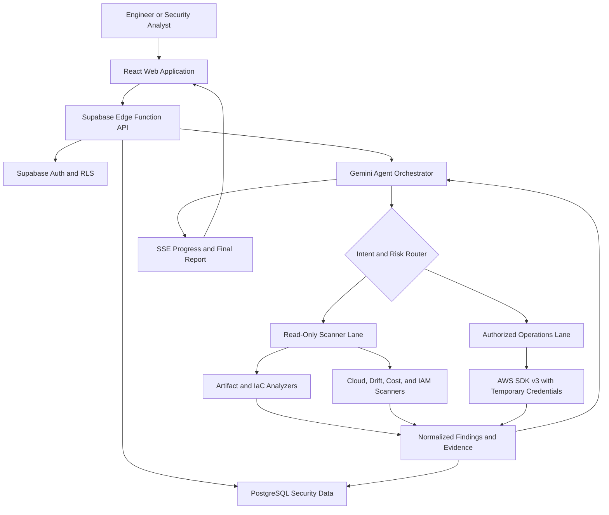

# ContainerSecAgent — AI-Powered Container and Cloud Security, From Scan to Remediation

ContainerSecAgent is an agentic security platform that analyzes container images, Dockerfiles, Kubernetes and Helm resources, infrastructure-as-code, CI workflows, and live cloud environments. It combines deterministic security scanners with an AI orchestration layer to explain findings, correlate risk across layers, recommend fixes, and—only when explicitly authorized—run controlled cloud-security operations.

The application is designed for engineers and security teams who want one workflow for supply-chain review, container hardening, IaC analysis, cloud posture validation, privilege-escalation detection, drift and cost checks, attack-path simulation, and auditable remediation guidance.

## Key Features

- **Unified security audits** — inspect repositories, Dockerfiles, Compose files, container images, Kubernetes manifests, Helm charts, Terraform, CloudFormation, and CI workflows.
- **Agentic investigation** — Gemini selects only the tools relevant to the user's intent, correlates their results, and completes a bounded investigation of at most 15 iterations.
- **Parallel scanner and operations routing** — read-only scanners can run concurrently while cloud-changing operations remain isolated behind explicit authorization.
- **Container and supply-chain analysis** — identify vulnerable packages, exposed secrets, unsafe base images, excessive privileges, weak runtime settings, and build-time risks.
- **Cloud and IAM analysis** — detect risky permissions, privilege-escalation paths, exposed security groups, configuration drift, and suspicious CloudTrail activity.
- **Attack simulation and evasion testing** — model likely attacker paths and test whether current controls detect common evasive behavior without executing destructive actions.
- **Actionable remediation** — receive prioritized findings, evidence, impact, exact fixes, safer configuration examples, and validation steps.
- **Streaming execution** — follow tool selection, progress, findings, and the final answer in real time over Server-Sent Events (SSE).
- **Secure multi-user data layer** — Supabase Auth, PostgreSQL, and Row Level Security isolate projects, scans, findings, credentials metadata, and audit history.
- **Temporary cloud access** — use short-lived AWS session credentials rather than persistent access keys.

## System Architecture

<p align="center"><strong>Figure 1 — ContainerSecAgent System Architecture</strong></p>



### Flow-by-Flow Explanation

1. **Request submission** — an engineer enters a natural-language goal and supplies one or more supported inputs in the React application.
2. **API and identity boundary** — the request reaches a Deno-based Supabase Edge Function. Supabase Auth identifies the caller, and Row Level Security restricts access to the caller's projects and scan history.
3. **Agent planning** — the Gemini orchestrator classifies the request, selects the smallest relevant tool set, and creates a bounded plan. An investigation may use up to 15 agent iterations.
4. **Intent and risk routing** — the router separates read-only analysis from operations that can change cloud state. Scanner tasks may run in parallel; mutations use the authorized operations lane.
5. **Artifact analysis** — repository and artifact analyzers inspect Docker, Kubernetes, Helm, Terraform, CloudFormation, Compose, CI, and related configuration inputs.
6. **Cloud analysis** — cloud scanners evaluate IAM, security groups, drift, cost, CloudTrail events, attack paths, and control-evasion scenarios.
7. **Authorized operations** — when a workflow explicitly calls for an approved AWS action, the operations lane invokes AWS SDK v3 with temporary session credentials. Read-only analysis never needs this lane.
8. **Normalization and correlation** — every tool returns structured findings with severity, evidence, affected resource, impact, remediation, and validation guidance. The agent correlates duplicates and cross-layer attack paths.
9. **Persistence and auditability** — scan runs, tool activity, normalized findings, and reports are stored in PostgreSQL under project-scoped RLS policies.
10. **Live result delivery** — progress and tool events stream to the UI over SSE. The final report summarizes risk, explains the evidence, and provides prioritized remediation steps.

## Tech Stack

| Layer | Technology | Purpose |
|---|---|---|
| Frontend | React 18, TypeScript, Vite | Fast typed web application |
| UI | Tailwind CSS, shadcn/ui | Accessible interface and reusable components |
| API/runtime | Supabase Edge Functions, Deno | Serverless orchestration and streaming APIs |
| Identity | Supabase Auth | User and session authentication |
| Database | Supabase PostgreSQL | Projects, scans, findings, tool events, and audit history |
| Authorization | PostgreSQL Row Level Security | Per-user and per-project data isolation |
| AI | Gemini 2.5 Flash Lite / Gemini 2.5 Flash | Intent classification, tool orchestration, correlation, and reporting |
| Cloud integration | AWS SDK for JavaScript v3 | Read-only discovery and explicitly authorized operations |
| Streaming | Server-Sent Events | Live agent and scanner progress |
| Security analysis | Unified audit and specialized container, IaC, IAM, drift, cost, replay, simulation, and evasion tools | Evidence-producing deterministic checks |

## Setup

### Prerequisites

Install the following before starting:

- Node.js 20 or later
- npm 10 or later
- Git
- Docker Engine with the Docker CLI
- Supabase CLI
- A Supabase project
- A Gemini API key or configured model-gateway credential
- Optional: temporary AWS credentials for live AWS workflows

### 1. Clone the repository

```bash
git clone https://github.com/ritvikindupuri/ContainerSecAgent.git
cd ContainerSecAgent
```

### 2. Install dependencies

```bash
npm install
```

### 3. Install and authenticate the Supabase CLI

```bash
npm install --global supabase
supabase login
supabase link --project-ref YOUR_SUPABASE_PROJECT_REF
```

### 4. Configure the frontend environment

```bash
cp .env.example .env.local
```

Set the public Supabase values in `.env.local`:

```dotenv
VITE_SUPABASE_URL=https://YOUR_SUPABASE_PROJECT_REF.supabase.co
VITE_SUPABASE_ANON_KEY=YOUR_SUPABASE_ANON_KEY
```

Never place service-role keys, model credentials, or AWS credentials in a `VITE_` variable; Vite exposes those values to the browser.

### 5. Configure server-side secrets

```bash
supabase secrets set GEMINI_API_KEY=YOUR_GEMINI_API_KEY
supabase secrets set GEMINI_MODEL_FAST=gemini-2.5-flash-lite
supabase secrets set GEMINI_MODEL_REASONING=gemini-2.5-flash
```

If the deployment uses a model gateway, set its endpoint and token instead:

```bash
supabase secrets set AI_GATEWAY_URL=https://YOUR_GATEWAY.example.com
supabase secrets set AI_GATEWAY_TOKEN=YOUR_GATEWAY_TOKEN
```

For local AWS testing, use temporary credentials:

```bash
export AWS_ACCESS_KEY_ID='YOUR_TEMPORARY_ACCESS_KEY_ID'
export AWS_SECRET_ACCESS_KEY='YOUR_TEMPORARY_SECRET_ACCESS_KEY'
export AWS_SESSION_TOKEN='YOUR_TEMPORARY_SESSION_TOKEN'
export AWS_REGION='us-east-1'
```

### 6. Start the local Supabase stack and apply the schema

```bash
supabase start
supabase db reset
supabase functions serve --env-file supabase/.env.local
```

### 7. Start the frontend

Open a second terminal in the repository:

```bash
npm run dev
```

Open `http://localhost:5173`.

### 8. Run quality checks

```bash
npm run lint
npm run typecheck
npm test
npm run build
```

### 9. Deploy

```bash
supabase db push
supabase functions deploy
npm run build
```

Deploy the generated `dist/` directory to the static hosting provider of your choice and configure `VITE_SUPABASE_URL` and `VITE_SUPABASE_ANON_KEY` in that environment.

## How to Use the Workflow

### Request Format

Every workflow accepts a natural-language `prompt` plus one or more inputs. Use the following canonical shape when calling the agent API:

```json
{
  "prompt": "Run a complete container and IaC security audit. Prioritize exploitable findings and provide exact fixes.",
  "inputs": [
    {
      "type": "repository",
      "value": "https://github.com/OWNER/REPOSITORY"
    }
  ],
  "mode": "read-only",
  "max_iterations": 15
}
```

Supported modes:

- `read-only` — scan, analyze, simulate, and recommend without changing cloud resources.
- `authorized-operations` — allow explicitly requested AWS operations using temporary credentials and the operations approval boundary.

`max_iterations` may be set from `1` through `15` and defaults to `15`.

### Allowed Inputs

| Input type | Exact `type` value | `value` example | Typical use |
|---|---|---|---|
| Git repository | `repository` | `https://github.com/OWNER/REPO` | Full source and configuration audit |
| Dockerfile | `dockerfile` | `./Dockerfile` | Build and runtime hardening |
| Container image | `container-image` | `ghcr.io/acme/api:1.4.2` | OS/package vulnerabilities and image metadata |
| Docker Compose | `docker-compose` | `./docker-compose.yml` | Multi-container configuration analysis |
| Kubernetes manifest | `kubernetes` | `./k8s/` | Workload, RBAC, network, secret, and pod-security review |
| Helm chart | `helm` | `./charts/api/` | Template and default-value analysis |
| Terraform | `terraform` | `./infra/terraform/` | Cloud misconfiguration and privilege paths |
| CloudFormation | `cloudformation` | `./infra/template.yaml` | AWS resource and IAM analysis |
| CI workflow | `ci-workflow` | `./.github/workflows/` | Pipeline permissions, secret exposure, and supply-chain risk |
| SBOM | `sbom` | `./artifacts/sbom.cdx.json` | Dependency and component analysis |
| CloudTrail events | `cloudtrail` | `./evidence/cloudtrail.json` | Replay, sequence analysis, and suspicious activity review |
| Live AWS scope | `aws-account` | `123456789012:us-east-1` | IAM, security group, drift, cost, and posture checks |
| Plain text | `text` | `Review whether this role can escalate privileges` | Questions and inline configuration snippets |

Local paths must be inside the uploaded workspace or checked-out repository. Use immutable image digests instead of mutable tags when a reproducible result is required.

### Exact Prompt Recipes

#### Complete unified audit

```text
Run a unified security audit across the supplied repository. Analyze Dockerfiles, container definitions, Kubernetes and Helm, Terraform, CloudFormation, and CI workflows. Correlate findings across layers, rank exploitable attack paths first, include evidence, and provide exact remediation and validation steps. Do not make changes.
```

#### Container image review

```text
Analyze the supplied container image for known vulnerabilities, embedded secrets, unsafe packages, weak provenance, unnecessary software, root execution, exposed ports, and risky metadata. Group duplicate findings, prioritize reachable critical and high risks, and provide a hardened replacement Dockerfile where possible.
```

#### Dockerfile hardening

```text
Review this Dockerfile line by line. Identify insecure base images, unpinned dependencies, secret leakage, unsafe ADD or curl-pipe-shell usage, excessive privileges, missing health checks, and unnecessary layers. Return an improved complete Dockerfile and explain every security-relevant change.
```

#### Kubernetes and Helm review

```text
Audit the supplied Kubernetes manifests and Helm chart for privileged workloads, dangerous capabilities, host access, writable root filesystems, missing resource limits, weak RBAC, exposed services, absent network policies, secret handling problems, and pod-security violations. Provide exact YAML patches and commands to validate them.
```

#### IaC privilege-escalation analysis

```text
Analyze the supplied Terraform and CloudFormation for cloud misconfigurations and privilege-escalation paths. Trace principals, permissions, trust relationships, resource policies, and reachable high-value resources. Show each attack path step by step and provide least-privilege patches. Do not apply changes.
```

#### CI/CD supply-chain review

```text
Review the supplied CI workflows for over-broad token permissions, unpinned third-party actions, pull-request injection, unsafe checkout behavior, secret exposure, artifact poisoning, cache poisoning, and untrusted code execution. Return a prioritized report and corrected workflow snippets.
```

#### AWS posture, drift, and cost scan

```text
Run read-only AWS IAM, security-group, configuration-drift, and cost scans in the supplied account and region. Correlate public exposure with permissions and workload identity. Flag unexpected drift and likely waste, but keep security risk separate from cost recommendations. Do not modify resources.
```

#### CloudTrail replay

```text
Replay and analyze the supplied CloudTrail events as a timeline. Identify suspicious sequences, privilege escalation, persistence, defense evasion, and data-access activity. Map each conclusion to exact event evidence and distinguish confirmed behavior from hypotheses.
```

#### Attack-path simulation

```text
Simulate the most realistic attack paths from the supplied container, Kubernetes, IaC, and cloud evidence. Do not execute destructive actions. For each path, list prerequisites, ordered steps, affected assets, expected detections, blast radius, and the smallest control change that breaks the path.
```

#### Detection-evasion test

```text
Evaluate whether the supplied controls and logs would detect common container and cloud defense-evasion techniques. Use safe simulation only. Report visibility gaps, expected telemetry, detection logic, false-positive considerations, and validation steps.
```

#### Authorized AWS operation

```text
In authorized-operations mode, apply only the following approved change: restrict security group sg-0123456789abcdef0 by removing inbound TCP 22 from 0.0.0.0/0 and allowing TCP 22 from 203.0.113.10/32. Show the planned API calls first, verify the current state, apply no other changes, and validate the final state.
```

Use `authorized-operations` only for a precise, explicitly approved mutation. Avoid broad prompts such as “secure everything” in that mode.

### Combining Inputs

Provide multiple inputs when you want cross-layer correlation:

```json
{
  "prompt": "Find end-to-end attack paths from the image through Kubernetes identity into AWS, then provide the minimum set of fixes. Do not make changes.",
  "inputs": [
    { "type": "container-image", "value": "ghcr.io/acme/api@sha256:REPLACE_ME" },
    { "type": "kubernetes", "value": "./k8s/" },
    { "type": "terraform", "value": "./infra/terraform/" },
    { "type": "aws-account", "value": "123456789012:us-east-1" }
  ],
  "mode": "read-only",
  "max_iterations": 15
}
```

### Reading the Result

A completed report contains:

1. Executive risk summary
2. Prioritized findings by severity and exploitability
3. Evidence and affected resources
4. Correlated attack paths
5. Exact remediation or patch examples
6. Validation commands and expected outcomes
7. Tool activity and audit trail
8. Assumptions, limitations, and unresolved questions

## Security Principles

- Prefer read-only mode for all investigation and simulation.
- Use temporary AWS session credentials with the minimum required permissions.
- Never place privileged secrets in frontend environment variables, prompts, logs, or committed files.
- Require precise scope for every cloud-changing operation.
- Treat AI conclusions as analysis; retain deterministic scanner evidence and validate changes before production rollout.
- Keep the 15-iteration limit enabled to bound tool use and execution time.

## License

Add the project's chosen license in a `LICENSE` file before distribution.
